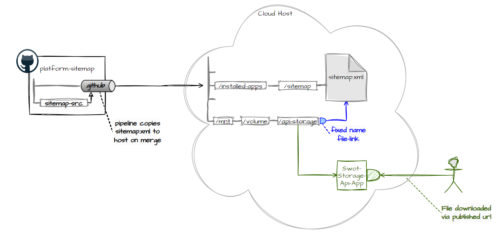
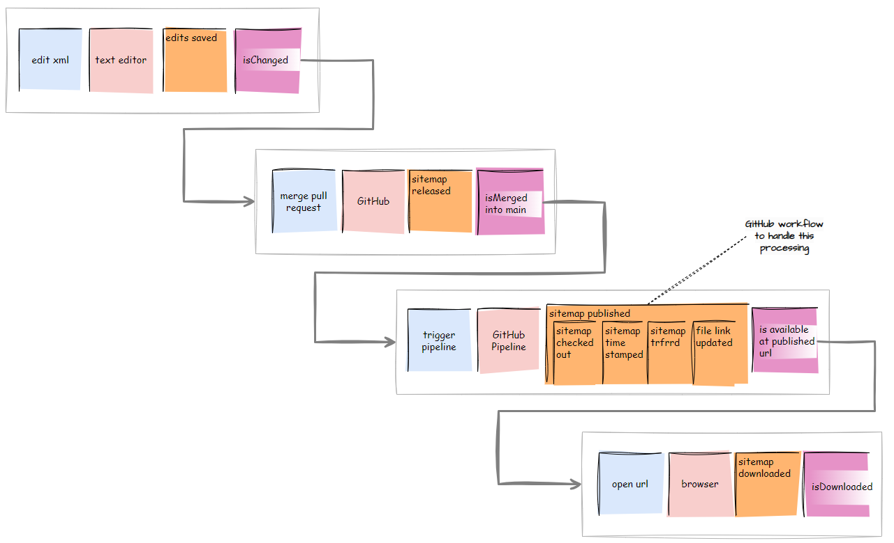

# platform-sitemap
Manage sitemap artifacts

## Overview

## Lifecycle

## Current Sitemap URL
The current sitemap can be downloaded from https://swotlearn.co.uk:9444/swot-storage/api/fetch/current-sitemap 
[Here is a link](https://swotlearn.co.uk:9444/swot-storage/api/fetch/current-sitemap) to above URL for convenience 
Note: The file currenly presented is a dummy placeholder file and only there for illustrative purposes

## Updating the file manually
To update the file replace the existing file located at `/mnt/volume-swot-docker/swot-files/api-storage/sitemap.xml.current-sitemap.UPLOADED` 
Privileged access (sudo) is required to update the file 
Once the pipelines are in place updating manually should be avoided. 
Also take a look at this [note on how and where to place the sitemap url](./_notes/placing-sitemap-xml.md) 

